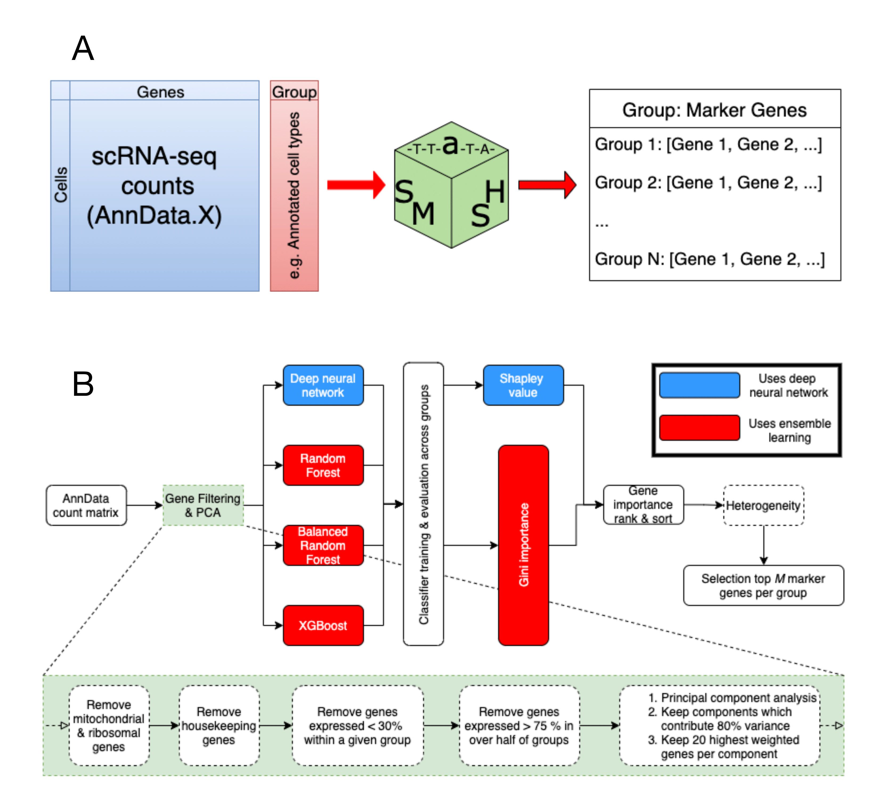
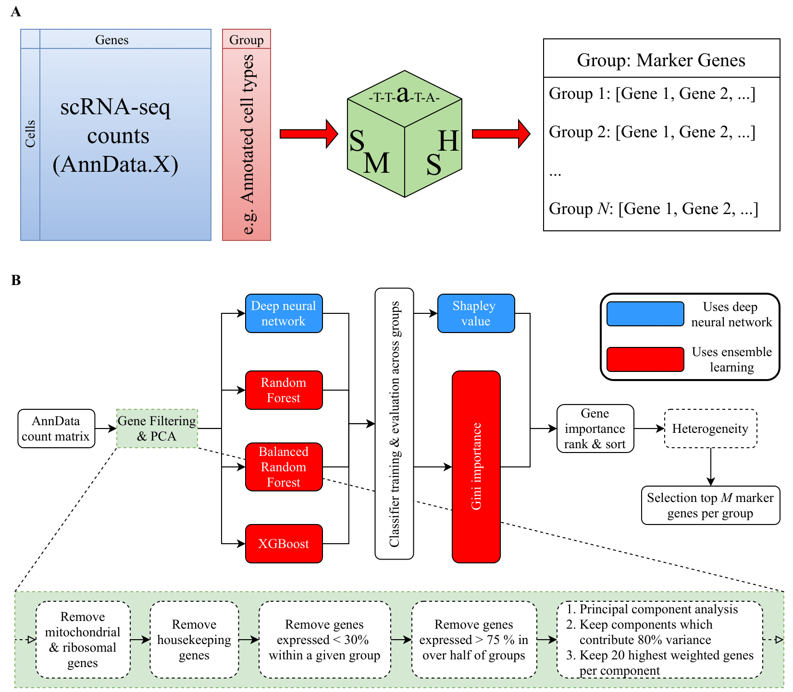

# SMaSH framework

## Overview 
The ```SMaSH``` (Scalable Marker gene Signal Hunter) framework is a general, scalable codebase for calculating marker genes from single-cell RNA-sequencing
data for a variety of different cell annotations as provided by the user, using supervised machine learning approaches.  These annotations can be truly general:
they can be broad cell types/clusters, detailed sub-types of different broad clusters, cell organ of origin, whether the cell inhabits tumour tissue, surrounding
microenvironment, or healthy tissue, and more besides. ```SMaSH``` implements marker gene extraction using four different models (Random Forest, Balanced Random Forest, XGBoost,
and a deep neural network) and two different information gain metrics (Gini impurity for the ensemble learners, and Shapley value for the neural network). For some details
on the ```SMaSH``` implementation (see Figure below) please consult our pre-print: https://www.biorxiv.org/content/10.1101/2021.04.08.438978v1. ```SMaSH``` is integrated with the ```ScanPy``` framework, working directly from the ```AnnData```
object of RNA-sequencing counts and a vector of user-defined annotations for each cell according to the marker gene extraction problem. 

<!--  -->


## Installation
```SMaSH``` is accessible on ```pypi``` (https://pypi.org/project/smashpy) and can be installed with ```pip```:

```
pip install smashpy
```
All package requirements and versions are summarised in ```setup.py``` and are automatically installed with ```SMaSH```. We therefore recommend the user
work from a fresh environment, such as is implemented in Anaconda:

``` 
conda -n smash_env 
conda activate smash_env
pip install smashpy
```

## Up and running with ```SMaSH``` ! 
The full ```SMaSH``` workflow is implemented sequentially from several functions, covering data preparation, initial gene filtering with principal components analysis, one of the
```SMaSH``` models for gene importance calculation, and the final ranking and selection of all genes from the initial ```AnnData``` object. For complete coverage of all models, we 
have included several notebooks in this repository (see ```notebooks/```), where each folder corresponds to a different publicly available data-set and contains four notebooks 
corresponding to a separate implementation of the four different ```SMaSH``` models for the gene importance calculation. Let's consider the Paul15 data-set, available from ```ScanPy```:

```
import scanpy as sc
obj = sc.datasets.paul15()
```

This can then be analysed step-by-step with the ```SMaSH``` functions, starting from the instantiation of the SMaSH object

```
import smashpy
sm = smashpy.smashpy()
```

Each step in the marker gene extraction chain (see Figure) can now be applied. For more details on each of these functions, see the examples provided in ```notebooks/``` and
the help service, where full details on the implementation and attributes of any ```SMaSH``` function ```func``` can be accessed with 

```
help(sm.func())
```

 Please note that the user-defined vector of annotations much be added for each cell
and stored as an object which can be accessed directly from the ```AnnData``` input, i.e. corresponding to

```
import numpy as np
obj.obs["annotation"] = np.array([my_annotations])
```

using the usual convention in ```ScanPy``` and ```AnnData```. 

For the ```obj```, and ```AnnData``` object of counts, and the additional user-defined set of annotations, we may now apply ```SMaSH``` step-by-step:

```
# Data preparation
sm.data_preparation(obj)

# Removing general genes
obj = sm.remove_general_genes(obj)

# Removing genes expressed in less than 30% within groups
obj = sm.remove_features_pct(obj, group_by="annotation", pct=0.3)

# Removing genes expressed in more than 50% in a given group where genes are expressed for more 75% within a given group
obj = sm.remove_features_pct_2groups(obj, group_by="annotation", pct1=0.75, pct2=0.5)

# Inverse PCA to remove unimportant genes
obj = sm.scale_filter_features(obj, n_components=None, filter_expression=True)

# Run deep neural network to locate optimal markers for classification of cells according to the orginal user annotations
sm.DNN(obj, group_by="annotation", model=None, balance=True, verbose=True, save=False)

# Top 20 genes as a final dictionary, for each annotation (class) provided
# Calculate the importances of each gene using the Shapley value
selectedGenes, selectedGenes_dict = sm.run_shap(obj, group_by="annotation", model=None, verbose=True, pct=0.1, restrict_top=("local", 20))

```

NB: To complete and up-to-date pipelines to follow step-by-step are in ```updated notebooks``` folder.


## Contact
We're always happy to hear of any suggestions, issues, bug reports, and possible ideas for collaboration.

Simone Riva <simo.riva15@gmail.com>, <sgr34@cam.ac.uk>, <sr31@sanger.ac.uk> (University of Cambridge, and Wellcome Sanger Institute) 

Mike Nelson <nelson@ebi.ac.uk> (University of Cambridge, and EMBL-EBI)
